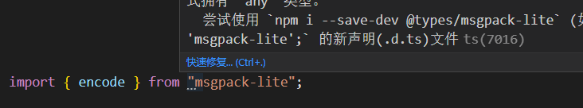
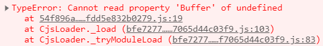
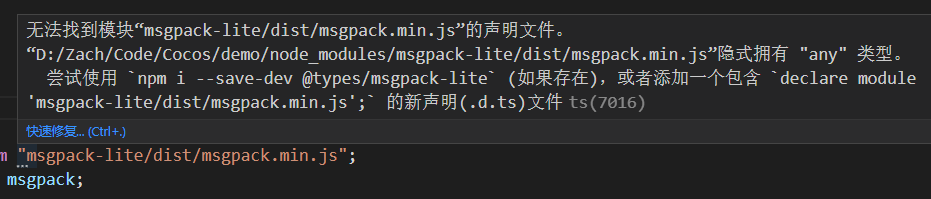

### 如何在 cocos 中使用 npm 的包？

npm 的包分很多种情况:
0. 包里没有web版本  --> 直接放弃
#### 1. 正常情况，ESM模块 + 有web版本 + 指向web版本
```
// 比如 msgpackr :
// 命令行install后
npm install --save msgpackr

// 直接就能用
import { pack } from "msgpackr";
```

#### 2. CJS模块 + 没有默认导出
```
// 比如 bech32:
npm install --save msgpackr

// import里有代码提示，但是打印出来是undefined
import { bech32 } from "bech32";

// 输出undefined
console.log(bech32);
``` 
解决这种情况:
```
// 需要在 tsconfig.json 中加上这个，允许默认导入
"allowSyntheticDefaultImports": true

// 然后改用如下写法
import b2 from 'bech32'
const { bech32 } = b2

console.log(bech32);
```

#### 3.CJS模块 + 没有默认导出 + 指向Node版本 + 没有声明文件 + 没有Web版本声明文件

```
比如 msgpack-lite
// 命令行install后
npm install --save msgpack-lite
```

```
// 然后使用:
npm install --save-dev @types/msgpack-lite

// 但还是和2一样输出undefined
console.log(encode);

// 和2一样解决
// 改用如下写法
import msgpack from "msgpack-lite";
const { encode } = msgpack;

// 红线提示“没有默认导出”，则在 tsconfig.json 中加上这个
"allowSyntheticDefaultImports": true
```
在编辑器控制台中输出的是 [Scene] [Function: encode]
但是在浏览器中预览时报错了
因为指向的是Node版本

所以需要改用如下写法，导入web版本
“Web 版本放在包下的 dist/xxx.js 或者 dist/xxx.min.js 文件里”
```
import msgpack from "msgpack-lite/dist/msgpack.min.js";
```
但是又出现了警告，因为没有web版本的声明文件

所以需要在这个路径下建一个同名的声明文件 msgpack.min.d.ts
里面写上
```
declare module "msgpack-lite/dist/msgpack.min.js" {
    export * from "msgpack-lite";
}
```
借用Node版本的类型声明，警告就消失了，搞定

文档中写的是 “任意新建个 .d.ts 到项目里”
测试多次后，发现不太准确，必须同名（包括min）
不是所有路径都可以，部分路径还是不行
所以仿照其他包的规则，就放在同一路径吧，也方便管理

### FAQ:
#### q: 怎么判断是ESM模块，还是CJS模块？
a:包的 package.json 中 有一级字段，“type”: “module”，则是ESM模块否则就是CJS模块（其实吧，看import有没有问题就是了）

#### q: 怎么判断包里有没有web版本？
a: 包里有没有这个文件 dist/xxx.js 或者 dist/xxx.min.js。

#### q: 怎么判断指向什么版本？
a: 光看 package.json 中的main字段，好像也不太准
因为msgpackr中的还长这样呢，“main”: “./dist/node.cjs”，但还是能直接from “msgpackr”
好像和这个有关
“在新版的 Node 里，package.json 加入了一个很好的机制来告诉用户什么情况应该使用哪个版本。”
是exports字段？
（其实吧，看浏览器预览会不会报错就是了）


#### q: 怎么判断有没有默认导出？
a: index.js 里没有 module.exports 这种写法，就没有默认导出
（其实吧，看代码红线就是了）

#### q: 怎么判断有没有声明文件？
a: 没有对应的 index.d.ts
（其实吧，看代码警告就是了）

#### q: 怎么判断有没有web版本声明文件？
a: 没有对应的 dist/xxx.min.d.ts
（其实吧，看代码警告就是了）

最后，明确一点浏览器的 js run time 和 nodejs 是完全不一样的，nodejs 内置的包在浏览器中无法运行 (比如 fs, path等).