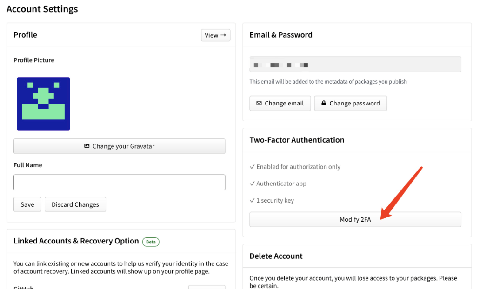

#### 记录一次发包到npm

可以使用第三方工具: [release-it](https://github.com/release-it/release-it)

```
具体的教程上面的链接都有，主要记录一下遇到的坑：

报错：
    'npm ERR! code EOTP\n' +
    'npm ERR! This operation requires a one-time password from your authenticator.\n' +
    'npm ERR! You can provide a one-time password by passing --otp=<code> to the command you ran.\n' +
    'npm ERR! If you already provided a one-time password then it is likely that you either typoed\n' +
    'npm ERR! it, or it timed out. Please try again.\n' +
```
看到这个错误需首先要到npm的官网去把2FA打开：

设置：


```
设置 npm为 auth-only:
npm profile enable-2fa auth-only
查看设置是否成功:
npm profile get
┌─────────────────┬─────────────────────────────┐
│ name            │ djytwy                      │
├─────────────────┼─────────────────────────────┤
│ email           │ djytwy@gmail.com (verified) │
├─────────────────┼─────────────────────────────┤
│ two-factor auth │ auth-only                   │
├─────────────────┼─────────────────────────────┤
│ fullname        │                             │
├─────────────────┼─────────────────────────────┤
│ homepage        │                             │
├─────────────────┼─────────────────────────────┤
│ freenode        │                             │
├─────────────────┼─────────────────────────────┤
│ twitter         │                             │
├─────────────────┼─────────────────────────────┤
│ github          │ djytwy                      │
├─────────────────┼─────────────────────────────┤
│ created         │ 2023-01-18T07:18:17.395Z    │
├─────────────────┼─────────────────────────────┤
│ updated         │ 2023-09-18T10:27:21.579Z    │
└─────────────────┴─────────────────────────────┘
然后先在目录中进行构建：
npm run build
打出dist目录
最后发布：
npm run release   
```